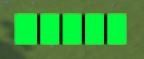
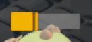

# 💡 Coding with C# and Unity
### List<things> ILearnedInC#
Delegates, coroutines, LINQ, Polymorphism, static class/methods, foreach loop, List, Queue, Stack, Dictionary, Interfaces
### List<things> ILearnedInUnity
Monobehaviors and its methods, Events,Scriptable Objects, new Input System, Colliders, Character Controller, Canva, 
Button, Images, Textures, Animator, Slider, Meshes, Camera, Pooling

# 🌇 Design patterns
While coding the game i learned about design patterns and implemented them gradually.
I would re-do a some parts differently but hey let's not touch what is not broken 😎
### Design patterns i used: visitors, composition over inheritance, observers, singleton.

# 💔 Healbars
## Procedurally generated
Every section delimited by thin vertical black lines represent 50hp.
The health bar design intuitively indicates the enemy's total health points to the player.
Additionally there is a color gradient from green = 100 to red = 0.  
100 Health points Bar:  
  
250 Health points Bar:  
  
Gradient from green to red:  
  

